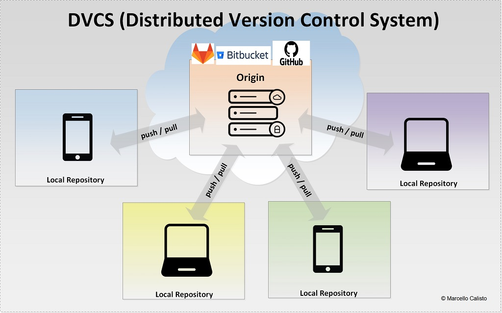
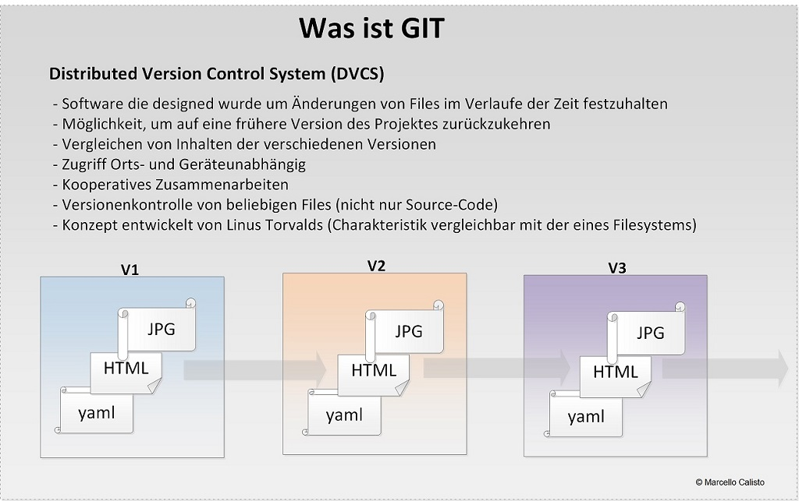
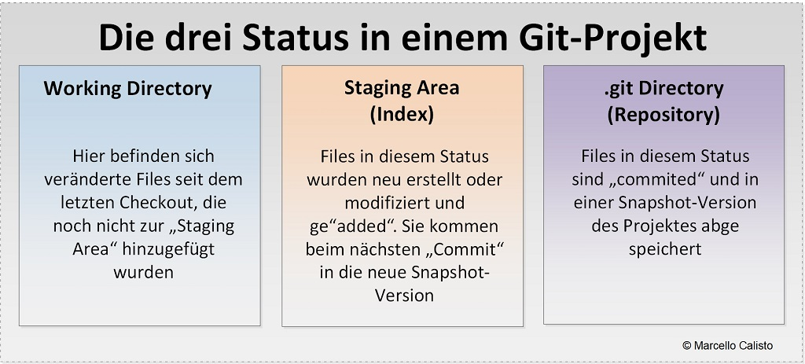
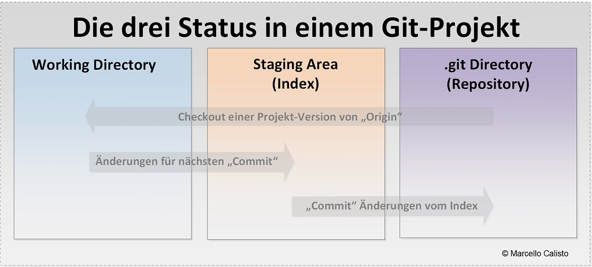
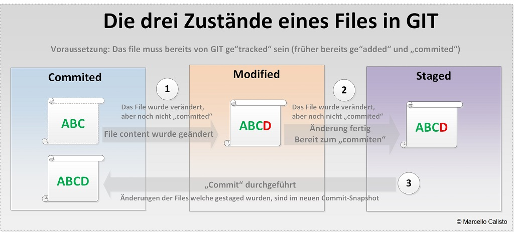
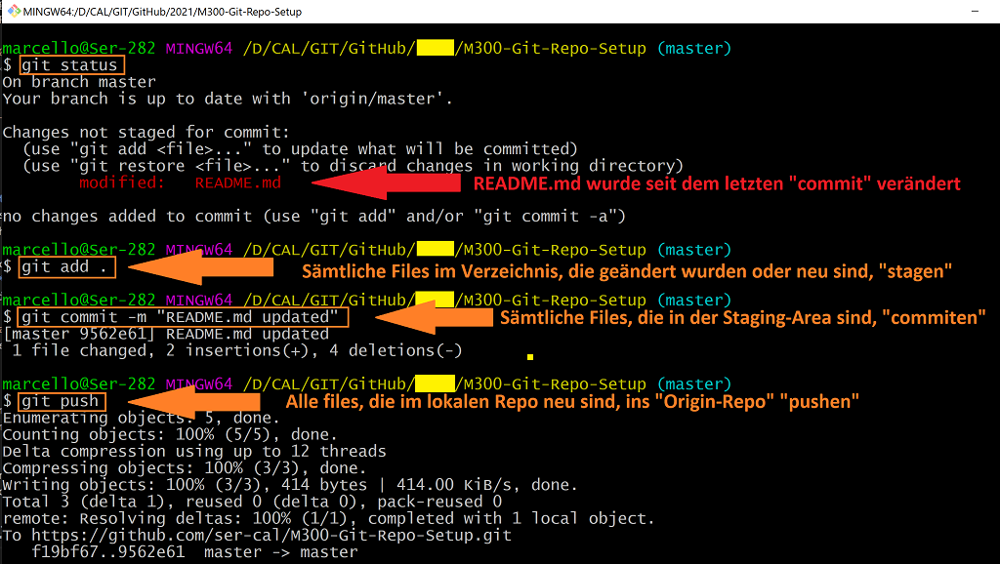

[10]: https://github.com
[11]: https://docs.github.com/en/github/authenticating-to-github/connecting-to-github-with-ssh
[20]: https://git-scm.com/
[21]: https://git-scm.com/book/en/v2


# M300 Einführung GIT und Setup des M300 Repositorys

Ziel dieses Projektes (Tutorials) ist es, dass die Lernenden ins Thema GIT einsteigen können und beim Durcharbeiten gleichzeitig ein Repository mit einer Grundstruktur für das Modul 300 aufsetzen<br>

## Voraussetzungen:
- [Github](https://github.com/) Account
- Windows: [GitBash](https://git-scm.com/downloads) auf dem lokalen Host installiert
- Mac oder Linux: (Bash bereits vorhanden, sonst ebenfalls auf [GitBash](https://git-scm.com/downloads)) verfügbar
- Editor: z.B: [Visual Studio Code](https://code.visualstudio.com/) , [Atom](https://atom.io/) oder [Sublime Text](https://www.sublimetext.com/) etc...

## Das folgende Dokument ist wie folgt strukturiert:
1. Im **ersten Abschnitt** **[Was ist GIT](#Was-ist-GIT)** wird grundsätzlich erklärt was GIT genau ist und welche Vorteile sich durch die Anwendung von GIT ergeben.

2. Im **zweiten Abschnitt** **[Git lokal einrichten und ein erstes Repository initialisieren und synchronisieren](#Git-lokal-einrichten-und-ein-erstes-Repository-initialisieren-und-synchronisieren)** werden die nötigen Schritte erläutert, welche zum Starten mit einem lokalen- und remote Git Repository nötig sind. 

3. Im **dritten Abschnitt**  **[Arbeiten mit Git](#arbeiten-mit-git)** geht es darum, die wichtigsten *Handgriffe* im Umgang mit Git zu lernen.

Git ist sehr umfangreich. Für den täglichen Gebrauch reichen aber wenige Kommandos und ein **generelles Verständnis über die Funktionsweise von Git**. Diese sind im **[Pro Git book][21]** (Kapitel 1 und 2) sehr gut beschrieben.  Alle in diesem Dokument verwendeten Kommandos finden sie ebefalls in diesen beiden Kapiteln wieder 

---


## Was ist GIT ##

GIT ist ein sogenanntes **Versionskontrollsystem** (VCS) und wurde Anfang 2005 von Linus Torvalds, dem Initiator des Linux-Kernels, entwickelt. Es erstaunt deshalb nicht, dass GIT konzeptionell ähnlich aufgebaut ist wie ein Linux-Filesystem. <br><br>
Torvalds wünschte sich ein verteiltes System, welches folgenden Anforderungen erfüllt:

- Unterstützung verteilter Arbeitsabläufe (Mehrere können an einem Projekt arbeiten)
- Hohe Sicherheit gegen sowohl unbeabsichtigte als auch böswillige Verfälschung
- Effizienz (Einfach und zweckmässige Handhabung)



Ein Versionskontrollsystem  wie **GIT** ist grundsätzlich ein Softwaretool, mit dessen Hilfe Entwickler Quellcode kooperativ verwalten können. Die Versionskontrollsoftware verfolgt jede Änderung am Code und speichert sie in einer speziell hierfür angelegten Datenbank (im Verzeichnis **.git**). Unterläuft einem Entwickler ein Fehler, kann er zu jeder Zeit einen (oder mehrere) Schritt(e) zurück machen, seinen Code mit früheren Codeversionen abgleichen und Korrekturen implementieren.
<br>

### **VCS** vs **DVCS** ###
- **VCS** (Version Control System) <br>
Solange die Daten nur lokal mit GIT getracked werden, spricht man von **VCS**

- **DVCS** (Distributed Version Control System)<br>
Sobald die Daten zusätzlich für andere (Contributors) freigegeben werden, spricht man nicht mehr von **VCS**, sondern von  **DVCS** (**D**istributed **V**ersion **C**ontrol **S**ystem)
<br>

Hier nochmals die wichtigsten Merkmale eines **Distributed Version Control Systems**

 <br><br>

---

## Git lokal einrichten und ein erstes Repository initialisieren und synchronisieren ##
In diesem Kapitel werden wir zuerst GIT auf dem lokalen Rechner konfigurieren und anschliessend das Grundgerüst für das M300-Repository einrichten

### Git Standard-kommandos (good to know)

#### Git-Version
> `$ git --version ` _aktuelle Version_ <br>
#### Git-Hilfe

> `$ man git ` _Manual Pages_ <br>
> `$ git help  ` _Allgemeine Hilfe / Quick Reference Porcelaine Commands_ <br>
> `$ git help config  ` _Spezifische Hilfe (in diesem Fall zu "Configuration"_<br>

### Git Konfigurations Dateien

Git hat folgende Konfigurationsdateien. Jede Ebene überschreibt die obige

* **System** ( --system )
    * `/etc/gitconfig` oder `c:\Program Files\Git\etc`
* **Personal** ( --global )
    * `~/.gitconfig` oder `%HOMEPATH%/.gitconfig`
* **Repository** ( --local )
    * `o	[GIT-REPOSITORY/]/.git/config`


Separate Auflistung (System, Global und Local)

> `$ git config --list --system  ` _zeigt die aktuelle System-Konfiguration_<br>
> `$ git config --list --global  ` _zeigt die globalen Settings_ <br>
> `$ git config --list --local  ` _zeigt die lokalen Settings_ <br>

Beispiel für eine **globale** Konfiguration (in unserem Fall eine geeignetes Setup):

*Username* und *E-Mail* in der **globalen** Konfiguration speichern. Diese werden später bei den Commit Informationen zugefügt. 

```
$ git config --global user.name "Marco Brunner"
$ git config --global user.email marco.brunner@tbz.ch
```
<br>

Überprüfen der Settings

> `$ git config --list  ` _Ohne weitere Paramenter, zeigt die aktuelle Konfiguration_<br>
> `$ git config --list --show-origin  ` _zeigt die Location der Git Config files_ <br>


 <br>

---

### Starten mit einem neuen Git-Repository 

Als erstes wird auf Github ein Repository erstellt. Danach bringen wir ein *vorhandenes, lokales Verzeichnis* unter **Git Versionskontrolle**, um diese beiden Repos anschliessend zu synchronisieren (verknüpfen). Ab dann können die lokalen Daten in das *remote Repository*  von [Github][10] **"ge"pushed** - oder umgekehrt, die Daten von [Github][10] in das lokale Repository **"ge"pulled** werden.

### Remote Git Repository erstellen

Vorbereitend für das **M300** erstellen wir auf [Github][10], ein neues, leeres Repository, mit welchem wir weiter unten dann das lokale Repository verknüpfen

> Ein hinterlegter **SSH-PublicKey** des lokalen Benutzers/Rechner ist Voraussetzung <br>
> Das Erstellen und Einrichten ist in den [GitHub Docs][11] ausführlich dokumentiert 

<br>

Folgende Settings für das [Github][10]-Repo sind vorgesehen (_Screenshot unten dient als Beispiel_):

> `Repository name:  ` _M300-Services_<br>
> `Description  ` _Microservices / Containerumgebungen_ <br>
> `Private:  ` _Repo auf "Private" setzen und LP einladen_<br>
> `Initialize this repository with:  ` _NICHTS ankreuzen - erfolgt zu einem späteren Zeitpunkt_ <br>


  
 

Nachdem wir das Repository auf [Github][10] erstellt haben, erhalten wir folgende Informationen, die sehr nützlich sind für die nächsten Schritte  (Import von lokalen Daten, die wir mit dem eben erstellten **"Origin-Repsitory"** synchronisieren und so unter die GIT-Versionskontrolle nehmen wollen).
<br><br>

Screenshot-Beispiel aus [Github][10]:

 
 <br>

#### Commands die wir (lokal auf der Gitbash) daraus nutzen

> `$ cd <Projektverzeichnis> ` _in das vorgesehene Verzeichnis wechseln_<br>
> `$ mkdir M300-Services  ` _Repository-Verzeichnis erstellen_ <br>
> `$ cd M300-Services  ` _Ins Repository-Verzeichnis wechseln_ <br>
> `$ git init  ` _Lokales Git-Repo initialisieren (erstellt .git-Verzeichnis)_ <br>
> `$ ls -al .git  ` _Checken, ob Metadaten im .git-Verzeichnis vorhanden sind_ 

#### VCS (Version Control System)
Das lokale Repo ist ab sofort im entsprechenden Verzeichnis aktiviert (z.B. auf einem Laptop). Wir haben nun also ein lokales **VCS** initialisiert. Es ist allerdings noch **leer**. Das macht aber weiter nichts. Um später auch über andere Geräte auf die bald hier abgelegten Daten zuzugreifen und diese Inhalte mit anderen zu teilen (Collaboration, Contribution), muss dieser "Content" auch noch **"global"** verfügbar gemacht werden. Wie bereits erwähnt, gibt es verschiedene Git-Repository-Hosting-Provider, die einen solchen Dienst anbieten (Github, Gitlab, Bitbucket etc..). Sobald mein Repo so aufgesetzt ist, nennt sich das Verwaltungssystem meines "Contents" dann nicht mehr **VCS** sondern neu **DVCS** (das **D** wurde ergänzt und steht für **"Distributed"**, also von überall zugreifbar und für verschiedene Personen nutzbar).


#### Erster Commit im lokalen Repository (lokal auf der Gitbash)
Mit den folgenden Kommandos wird ein erstes File (in unserem Fall das README.md) im getrackten Verzeichnis erstellt, ge'stage'd und commited. Mit dem "Commit" wird der aktuelle Stand in mein lokales Repository eingepflegt (Snapshot im Metadatenverzeichnis). 

> `$ echo "# M300 Dokumentation" >> README.md  ` _File "README.md" mit Titel erstellen_<br>
> `$ git add .   ` _Added alle Files im aktuellen Verzeichnis zur "Staging area"._ <br>
> `$ git commit -m "First Commit  ` _Files werden ab jetzt lokal getracked_ <br>
> `$ ls -al .git  ` _Checken, ob Metadaten im .git-Verzeichnis vorhanden sind_ 

#### Synchronisation des lokalen Repos mit dem Github-Repository (Origin)
...jetzt muss das lokale Repository mit dem Remote-Repository gesynched werden, damit ich das kollaborative Arbeiten daran ermögliche. Im nächsten Schritt wird das lokale Repository mit dem auf Github-Repository einmalig "verlinkt". Danach kann das Repository jeweils **ge"pushed"**, **ge"pulled"**, **ge"klont"**, **ge"forked"** oder **ge"branched"** werden. Dies geschieht mit folgendem Kommandeo:

> `$ git remote add origin https://github.com/<Benutzername>/M300-Services.git   ` _Verlinken der Repos_ <br>
> `$ git push -u origin master   ` _Github-Passwort eingeben und hochladen_


Hier nun die Kommandos, wie sie in der richtigen Reihenfolge eingegeben werden (ohne Kommentare)

```
$ cd <Projektordner>
$ echo "# M300 Dokumentation" >> README.md
$ git init
$ git add README.md
$ git commit -m "first commit"
$ git remote add origin https://github.com/<Benutzername>/M300-Services.git
$ git push -u origin main
``` 

#### Summary
- Zuerst wurde das Git-Repository "M300-Services" lokal und remote (Origin) erstellt und verlinkt (Daten werden ab diesem Zeitpunkt getracked und können gepushed und gepulled werden) 
- Im lokalen Git-Repository wurde das File "README.md" erstellt und commited. Daten im Verzeichnis werden nun also **lokal** (z.B. Laptop) verwaltet und getrackt.
- Abschliessend wurde mit dem "git push"-Kommando der aktuelle lokale Repo-Inhalt zum **"Origin"** (Github-Repo, Remote) übertragen.  

Jetzt sind wir bereit, um das Repository aktiv zu bewirtschaften - **IaC** (Infrastructure as Code) ready

---

## Arbeiten mit GIT ##
Jetzt, wo alles soweit bereit ist, um loszulegen, setzten wir uns noch kurz mit dem bevorstehenden M300-Projekt auseinander. Grundsätzlich benötigen wir **nicht viele**  Git-Kommandos. Wir schauen uns aber die wichtigsten Elemente kurz an, damit wir nachher möglichst speditiv und problemlos starten - und den Fortschritt festhalten können.

### Topics:
- **[Git Prozess](#Git-Prozess)**
- **[Die wichtigsten und am häufgsten gebrauchten Git-Kommandos](#Die-wichtigsten-und-am-häufgsten-gebrauchten-Git-Kommandos)**
- **[Auftrag: Repository mit Inhaltsvorgaben für das M300 erstellen](#auftrag:-repository-mit-inhhaltsvorgaben-für-das-m300-erstellen)**


- **[Auftrag "Repository mit Inhaltsvorgaben für das M300 erstellen"](#Auftrag-"Repository-mit-Inhaltsvorgaben-für-das-M300-erstellen")**


----

### Git Prozess
Wenn wir mit Git arbeiten, sollten wir die drei Status (Mehrzahl von Status ist ebenfalls Status ;-) ) kennen.

Das folgendes Diagramm hält fest, wann welcher Status erreicht ist. <br> **Achtung!** es handelt sich dabei lediglich um das **lokale** Repository

  

Im **Working Directory** befinden sich alle neuen und veränderten Files, die noch nicht fertig bearbeitet sind und deshalb **NICHT** ge"staged" wurden. Ein Beispiel wäre ein neues Dokument, das noch in Bearbeitung ist.

In der **Staging Area** (Index) befinden sich sämtliche Files, die verändert oder neu erstellt wurden und nun soweit fertig bearbeitet sind, um sie mit dem nächsten "Commit" in die Datenbank einzulesen.

Im **Repository** (.git-Directory) befinden sich sämtliche Daten, die bereits schon zu einem früheren Zeitpunkt "Commited" wurden und somit von GIT "getracked" werden.


Der Weg einer Änderung an einem File bis zum Versionierten Commit läuft folgendermassen ab


  


### Die drei Zustände eines Files
Auf dem folgenden Bild sind die drei unterschiedlichen Zustände eines Fils nochmals farblich dargestellt. Sobald ein file im Verzeichnis verändert wird (roter Buchstabe "D"), kommt es in den Zustand **Modified**. Wenn die Änderungen abgeschlossen sind und der Bearbeiter damit zufrieden ist, kann er das File mit "git add" in die Staging-Area legen (Rechts Violett). Es ist dann also im Status **Staged** und wartet da, bis der nächste "Commit" erfolgt. Danach ist wird es als **Commited** registriert (links Blau) und ist somit wieder mit der aktuellsten Version gespeichert. <br>
Nochmals: Diese Transaktionen finden allesamt **lokal** statt. Erst wenn das Repository ge"pushed" wird, ist auch das Origin-Repository auf dem aktuellsten Stand!


  


|Command | Working Directoriy | Stage (Index)| local Repository |
|:--:|:--:|:--:|:--:|
||File neu oder geändert|||
|git add||Änderung staged||
|git commit|||Änderung versioniert|


> mit `git commit -a` kann der Index umgangen werden

---
#### Arbeiten im Working Directory (lokal)

File oder Verzeichnis unter Git Control löschen

`$ git rm {file} / $ git rm {dir}`

File oder Verzeichnis unter Git Control verschieben

`$ git mv {file} / $ git mv {dir}`

> zum Löschen oder Verschieben immer die **git Kommandos**  `git rm` oder `git mv` verwenden

---
#### Arbeiten mit dem Index (stage)

Zeigt den aktuellen File Status

`$ git status`

Neues oder geänderte File(s) der Staging-Area zufügen.

`$ git add {file}`

> `git add .` fügt **alle** neuen oder geänderten Files dem Index zu

Ein versehentlich ge-staged File wieder aus dem Index entfernen

`$ git reset HEAD {file}`

#### Inhalt des Staging ansehen

Zeigt was im Worsplace geändert, aber noch nicht im Index (staged) ist.

`$ git diff`

Zeigt was bereits zum Commit vorgemerkt wurde.

`$ git diff --cached`  (auch -- staged)

---
#### Arbeiten mit dem lokalen Repository

Im Index vorgemerkte Änderungen in das lokale Repository committen

`git commit {file}`

Commit Historie ansehen

`$ git log`


Ein im Workplace modifiziertes File wieder auf den Stand des letzter Commit setzen

`$ git checkout -- {file}`

---
#### Arbeiten mit dem remote Repository

Remote Repository anzeigen

`$ git remote -v`

Alle Änderungen vom remote Repository (origin) in den Workplace laden

`$ git pull` 

> sind Files lokal und remote geändert, entsteht ein Konflikt

Änderungen vom lokalen Repository nach remote pushen

`git push origin`

> vor einem `push` immer zuerst ein `pull` ausführen

---
#### Arbeiten mit Tags

**Tags** sind wie **Snapshots** - sie halten den Zustand zu einem bestimmten Zeitpunkt fest. So können sie jederzeit wieder auf einen Taged Stand ihrer Umgebung zurückgreifen. 

 > Tagged Versionen sind nicht geeignet um an diesen weiter zu arbeiten. Dazu sieht git **Branches** vor, worauf wir hier nicht weiter eingehen werden.

Vorhandene Tags listen

`$ git tag`

Tag erstellen (Annonated)

`$ git tag -a v1.5 -m "Version 1.5"`

> -a erstellt einen Annonated (Kommentierte) Tag

Tag Content ansehen 

`git tag show v1.5`

Einen spezifischen Tag nach origin pushen

`$ git push origin v1.5`

> `git push origin --tags` alle Tags gleichzeitig pushen

Lokale Tags löschen

`$ git tag -d v1.5`

Remote Tags löschen

`$ git push origin --delete v1.5`


---

### Die wichtigsten und am häufgsten gebrauchten Git-Kommandos
...in a Nutshell

  


Hier kurz und bündig nochmals die mit Abstand wichtigsten Git-Kommandos.<br> 
**Nicht vergessen**: man **muss** im entsprechenden Projektordner sein

```
$ cd <Projektordner>
$ git status
$ git add .
$ git commit -m "Nutzvolle Information kurz gehalten"
$ git push
``` 
Arbeitet man kooperativ mit anderen Personen oder auch mit unterschiedlichen Geräten, macht es Sinn, vor dem Verändern **IMMER** noch mit folgendem Kommando das aktuelle Remote-Git-Repo zu synchronisieren:

```
$ cd <Projektordner>
$ git pull
```


  


---

## Auftrag: repository mit inhhaltsvorgaben für das m300 erstellen


Nun haben Sie die notwendigen Vorkenntnisse, um loszulegen. Das Ziel ist es, dass Sie am Ende des Moduls ein erstes **deklaratives** Script erstellt haben, welches ganz im Sinn von **IAC** (Infrastructure as Code) beides, nämlich "Dokumentation" und "Code" beinhaltet und jederzeit nach Belieben kooperativ weiterentwickelt werden kann.<br>

### Die Dokumentation soll wie folgt heissen und gegliedert sein:

### Repository-Name: M300-Services 

### Hauptverzeichnis:

* **README.md**
    * `Einleitung allgemein`
    <br>_(Summary mit sinnvollen Erklärungen und Links zu Unterverzeichnissen_)
    * `Inhaltsverzeichnis`:
    <br>_(An M300-Repo angelehnt - mit ergänzenden Unterverzeichnissen)_
        * 10-Toolumgebung
        * 20-Infrastruktur 
        * 25-Sicherheit 1
        * 30-Container
        * 35-Sicherheit 2
        * 40-Container-Orchestrierung
        * 50-Add-ons _(Eigene Ergänzungen erwünscht)_
        * 60-Reflexion _(Lernprozess festgehalten, Form frei wählbar)_
          
    * `Einführende, kurz gehaltene Erklärungen zu den Arbeiten (LB1 und B2) `<br>_(Details im entsprechenden Unterordner, siehe unten)_

* **/LB1** Ordner
    * `README.md` _(1. Einleitung, 2. Inhaltsverzeichnis 3. Service-Aufbau, z.B. Setting Struktur, deklarativer Ablauf 4. Umsetzung, 5. Testing 6. Quellen)_
    * `/images` Ordner _(Bilder, die zur LB1-Doku verlinkt werden)_

* **/LB2** Ordner
    * `README.md` _(1. Einleitung, 2. Inhaltsverzeichnis 3. Service-Aufbau, z.B. Setting Struktur, deklarativer Ablauf 4. Umsetzung, 5. Testing 6. Quellen)_
    * `/images` Ordner _(Bilder, die zur LB2-Doku verlinkt werden)_

* **/images** Ordner
    * `Nur Bilder oder Screenshots für Gesamtprojekt`
    <br> _(Alles, ausser LB1 und LB2-Pics/Screenshots)_


<br>

### **WICHTIG:** Bei Verwendung von nicht selbstgeschriebenem Code **muss die Quelle zwingend angegeben werden**

<br>

# Viel Spass und viel Erfolg

- - -
<a rel="license" href="http://creativecommons.org/licenses/by-nc-sa/3.0/ch/"></a><br />Dieses Werk ist lizenziert unter einer <a rel="license" href="http://creativecommons.org/licenses/by-nc-sa/3.0/ch/">Creative Commons Namensnennung - Nicht-kommerziell - Weitergabe unter gleichen Bedingungen 3.0 Schweiz Lizenz</a>.